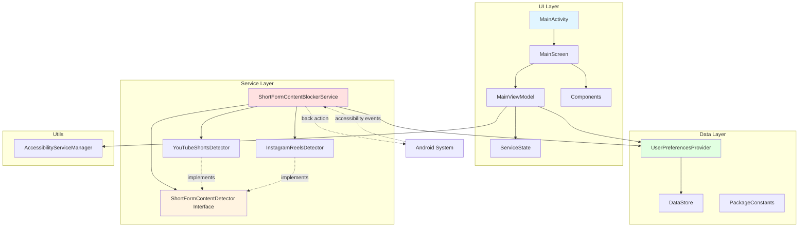
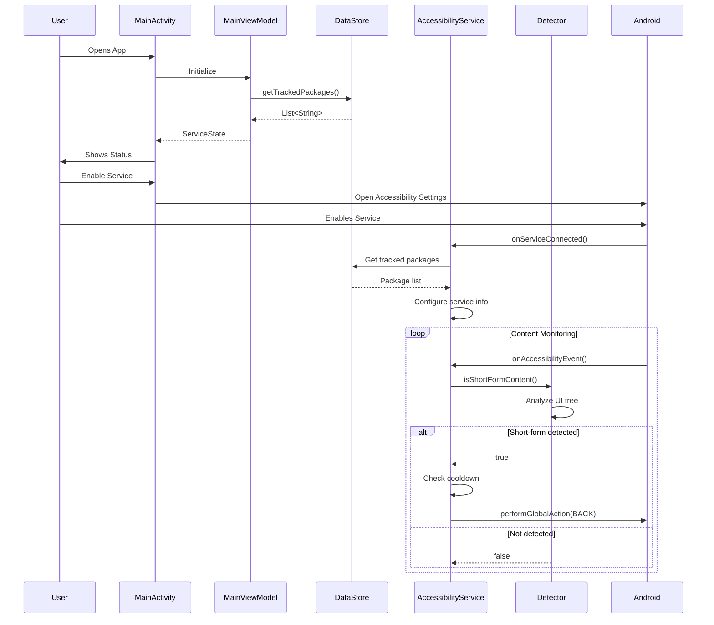
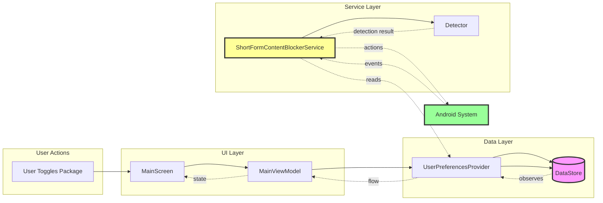
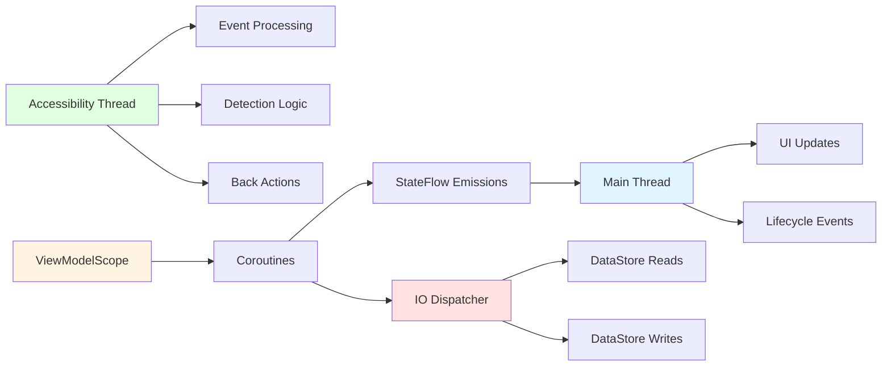
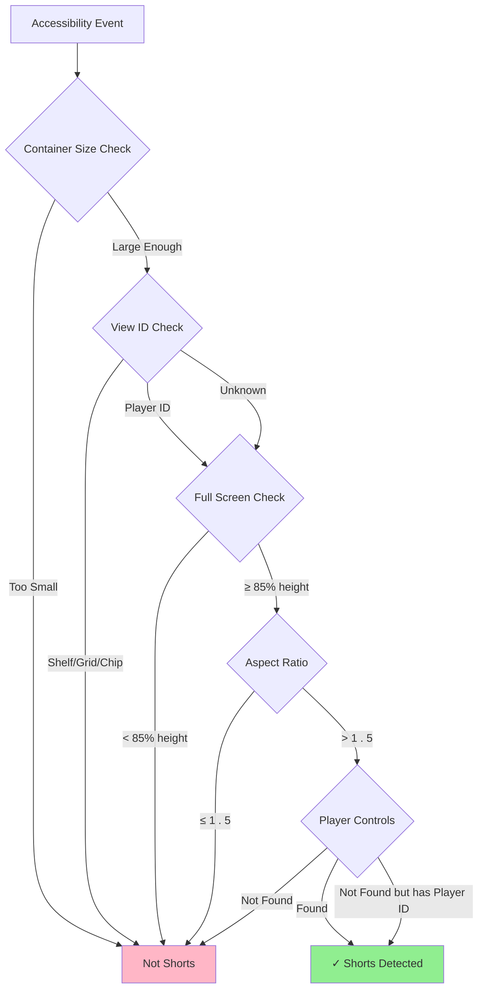
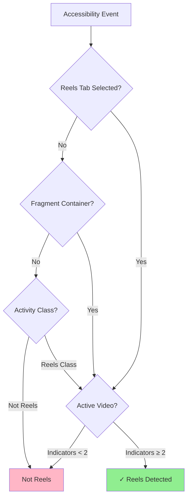
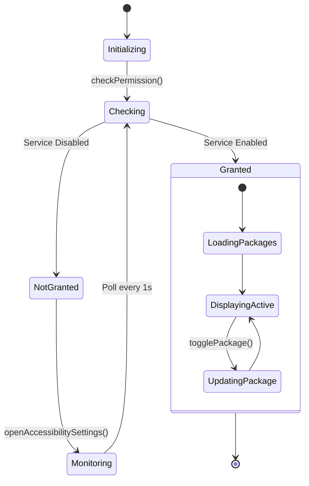
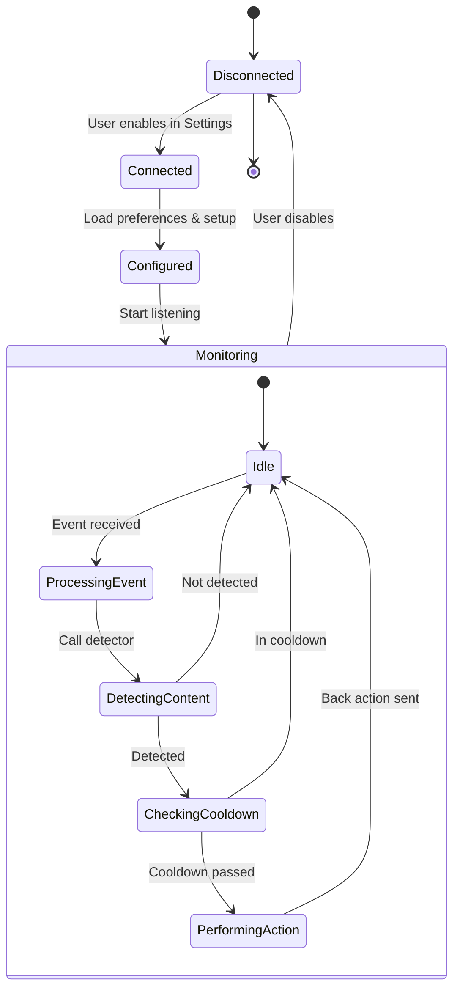

# Module :app

Technical deep dive into the Shorts Blocker architecture, component interactions, and data flow.

## Architecture Overview

Shorts Blocker follows a clean architecture pattern with clear separation of concerns:

- **UI Layer**: Jetpack Compose with MVVM
- **Domain Layer**: Business logic and detectors
- **Data Layer**: DataStore for preferences
- **Service Layer**: Accessibility service running independently

## High-Level Architecture



## Detailed Component Flow



## Data Flow



## Component Breakdown

### UI Layer

#### MainActivity

**Responsibility**: Host the Compose UI

**Key Features**:

- Sets up Compose theme
- Hosts MainScreen
- Lifecycle management

**Dependencies**:

- MainScreen (Compose)
- Theme components

#### MainScreen

**Responsibility**: Display service status and package toggles

**Key Features**:

- Observes ViewModel state
- Lifecycle-aware permission checking
- Conditional UI (active vs setup)
- Package toggle list

**State Management**:

```kotlin
data class ServiceState(
    val isGranted: Boolean,
    val isChecking: Boolean,
    val trackedPackages: List<TrackedPackage>
)
```

#### MainViewModel

**Responsibility**: Business logic and state management

**Key Features**:

- Permission checking
- Monitoring permission changes
- Package toggle management
- StateFlow for reactive UI

**Flow**:

```
User Action → ViewModel → DataStore → ViewModel → UI Update
```

### Service Layer

#### ShortFormContentBlockerService

**Responsibility**: Core accessibility service

**Lifecycle**:

1. `onServiceConnected()` - Initialize, load preferences, configure
2. `onAccessibilityEvent()` - Process events, detect content
3. `onInterrupt()` - Handle interruptions
4. Service runs independently of UI

**Event Processing**:

```kotlin
onAccessibilityEvent(event) {
    1.Get package name from event
    2.Find appropriate detector
    3.Get accessibility windows
    4.For each focused window :
    -Get root node
    -Call detector . isShortFormContent ()
    -If detected : perform back action (with cooldown)
}
```

**Cooldown Mechanism**:

- Prevents repeated actions
- 1.5 second cooldown per detection key
- Uses `SystemClock.uptimeMillis()` for timing
- Thread-safe with `ConcurrentHashMap`

#### Detectors

**Interface**: `ShortFormContentDetector`

```kotlin
interface ShortFormContentDetector {
    fun isShortFormContent(
        event: AccessibilityEvent,
        rootNode: AccessibilityNodeInfo,
        resources: Resources
    ): Boolean

    fun getPackageName(): String
}
```

**YouTubeShortsDetector**:

- Checks container size (excludes thumbnails)
- Verifies full-screen content (85%+ height)
- Portrait aspect ratio (> 1.5)
- Searches for Shorts-specific view IDs
- Scans for video player controls

**InstagramReelsDetector**:

- Verifies Reels tab is selected
- Checks for Reels fragment container
- Confirms active video playback
- Requires multiple indicators (≥2)
- Distinguishes from Stories/Feed

### Data Layer

#### UserPreferencesProvider

**Responsibility**: Manage app preferences

**Key Operations**:

- `getTrackedPackages()` - Flow of enabled packages
- `setTrackedPackages()` - Update enabled list
- `getTrackedPackagesWithStatus()` - All packages with status
- `togglePackage()` - Enable/disable single package
- `initializeDefaultPackages()` - First-run setup

**Storage Format**:

```
Key: "dev.atick.shorts.preferences"
Value: "com.google.android.youtube,com.instagram.android"
```

**Flow Pattern**:

```kotlin
Flow<List<String>> = dataStore.data.map { preferences ->
    preferences[key]?.split(",") ?: DEFAULT
}
```

#### PackageConstants

**Responsibility**: Central configuration

**Contents**:

- Package identifiers
- Available packages with metadata
- Default enabled packages

**Usage**: Single source of truth for supported apps

### Utils

#### AccessibilityServiceManager

**Responsibility**: Service state management

**Key Functions**:

- `isAccessibilityServiceEnabled()` - Check if service is running
- `openAccessibilitySettings()` - Navigate to settings

**Detection Method**:

```kotlin
1.Read ENABLED_ACCESSIBILITY_SERVICES from Settings . Secure
        2.Parse colon -separated service list
3.Match against our service name
```

## Threading Model



**Thread Usage**:

- **Main Thread**: UI rendering, Compose recomposition
- **IO Dispatcher**: DataStore operations (read/write preferences)
- **Accessibility Thread**: Event processing, detection, actions
- **ViewModelScope**: Coroutines for async operations

**Thread Safety**:

- DataStore is thread-safe by design
- Accessibility events are single-threaded
- ConcurrentHashMap for cooldown timestamps
- StateFlow for thread-safe state updates

## Detection Algorithm

### YouTube Shorts



### Instagram Reels



## State Management

### ViewModel State Flow



### Service Lifecycle



## Performance Considerations

### Optimization Strategies

1. **Lazy Initialization**
   ```kotlin
   private val detectors by lazy { /* ... */ }
   ```
    - Detectors created only when needed
    - No upfront cost

2. **Node Scanning Limits**
    - YouTube: Max 80 nodes
    - Instagram: Max 100-150 nodes
    - Prevents excessive tree traversal

3. **Early Exit Patterns**
   ```kotlin
   // Exit early if container too small
   if (height < 400 || width < 300) return false
   ```

4. **Cooldown Prevention**
    - Reduces duplicate processing
    - Prevents action spam
    - Minimal memory overhead

5. **Event Filtering**
   ```kotlin
   eventTypes = WINDOW_STATE_CHANGED or 
                WINDOW_CONTENT_CHANGED or 
                VIEW_SCROLLED
   ```
    - Only relevant events processed

### Memory Management

- DataStore: Async, off-heap storage
- Accessibility nodes: Recycled automatically by system
- No retained node references (leak prevention)
- StateFlow: Conflated, keeps only latest state

## Security & Privacy

### Permissions

**Required**:

- `BIND_ACCESSIBILITY_SERVICE` - Core functionality

**Explicitly NOT Used**:

- `INTERNET` - No network access
- `READ_EXTERNAL_STORAGE` - No file access
- `LOCATION` - No location tracking

### Data Privacy

**What's Stored**:

- User-selected package names (local DataStore)
- No content, no URLs, no browsing history

**What's Processed**:

- UI element IDs (in memory only)
- Screen dimensions (not persisted)
- Detection results (logged in debug, not stored)

**Accessibility Data**:

- Processed in real-time
- Never stored or transmitted
- Discarded after detection

## Testing Strategy

### Unit Testing Targets

- **ViewModels**: State updates, permission checks
- **UserPreferencesProvider**: CRUD operations
- **PackageConstants**: Configuration validity

### Integration Testing Targets

- **Detector Logic**: Mock accessibility tree
- **Service Configuration**: Proper event types
- **UI State**: ViewModel → UI updates

### Manual Testing Requirements

- Real devices (emulators lack target apps)
- Different Android versions
- Various screen sizes/densities
- Different app versions

## Extending the Architecture

### Adding New Platform Support

1. **Create Detector**
   ```kotlin
   class TikTokDetector : ShortFormContentDetector { ... }
   ```

2. **Register in Service**
   ```kotlin
   "com.zhiliaoapp.musically" to TikTokDetector()
   ```

3. **Add to Constants**
   ```kotlin
   const val TIKTOK_PACKAGE = "com.zhiliaoapp.musically"
   ```

4. **UI Auto-Updates** (no changes needed)

### Customization Points

- **Cooldown Duration**: `actionCooldownMillis`
- **Node Scan Limits**: In each detector
- **Event Types**: `AccessibilityServiceInfo.eventTypes`
- **Detection Thresholds**: Height %, aspect ratio, indicators

## Build Variants

### Debug

- Timber logging enabled
- No minification
- Debug keystore

### Release

- No logging
- ProGuard enabled
- Release keystore required
- Optimized APK

## Dependencies

**Core**:

- Kotlin 2.0+
- Jetpack Compose (BOM)
- Material 3

**Architecture**:

- ViewModel
- Lifecycle
- DataStore Preferences

**Utilities**:

- Timber (debug logging)

**Build**:

- Gradle 8.13
- Android Gradle Plugin 8.x

---

**Last Updated**: 2025-12-06  
**Architecture Version**: 1.0  
**Maintainer**: [Atick Faisal](https://github.com/atick-faisal)
