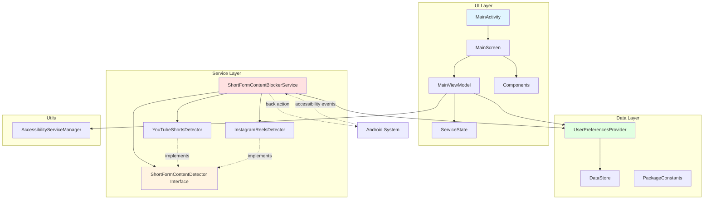
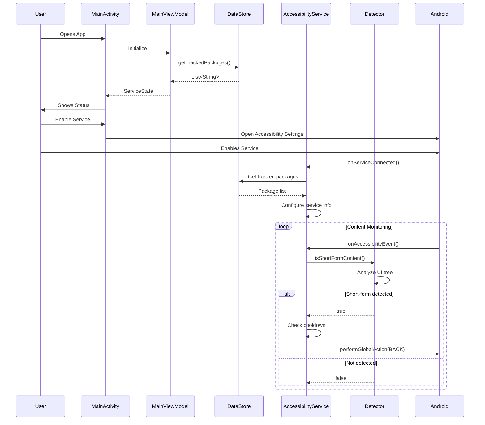
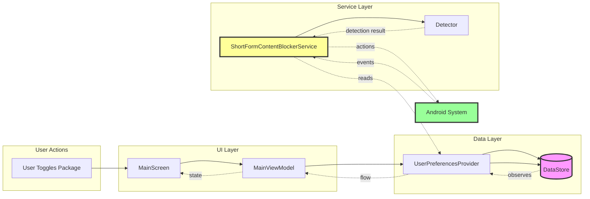
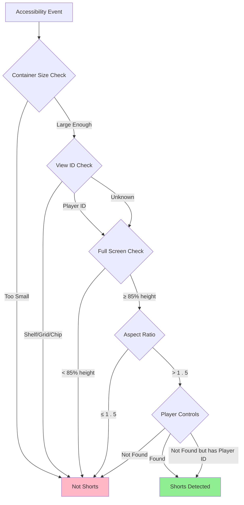
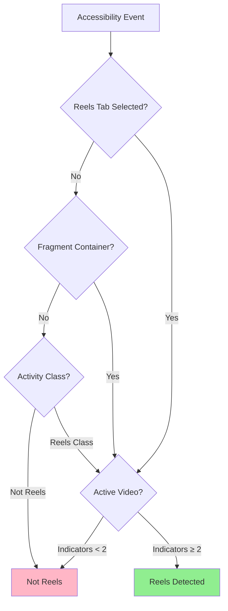
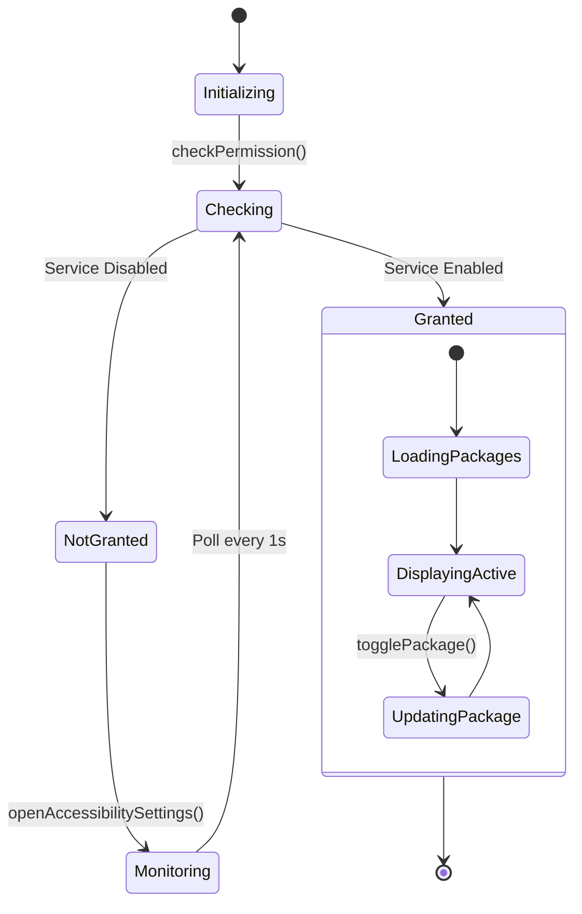
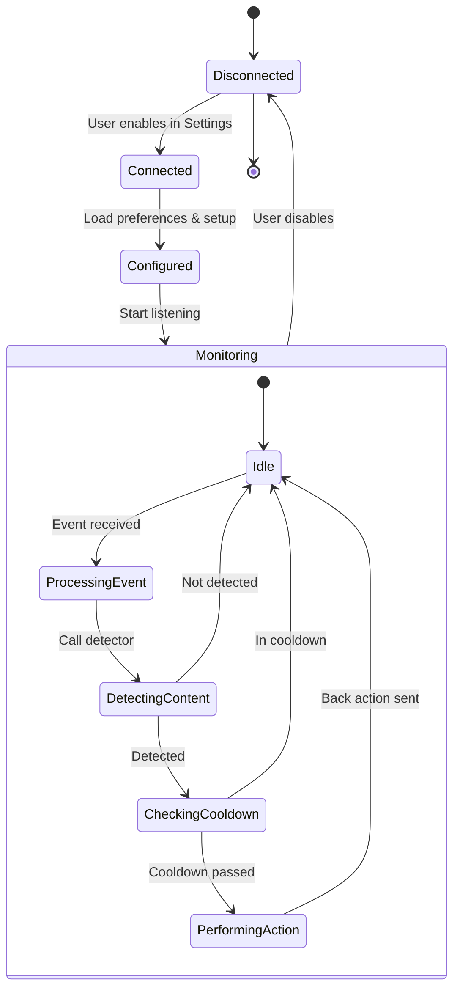

# Module :app

Technical deep dive into the Shorts Blocker architecture, component interactions, and data flow.

## Architecture Overview

Shorts Blocker follows a clean architecture pattern with clear separation of concerns:

- **UI Layer**: Jetpack Compose with MVVM
- **Domain Layer**: Business logic and detectors
- **Data Layer**: DataStore for preferences
- **Service Layer**: Accessibility service running independently

## High-Level Architecture

## Detailed Component Flow

## Data Flow

## Detection Algorithm

### YouTube Shorts

### Instagram Reels

## State Management

### ViewModel State Flow

### Service Lifecycle

